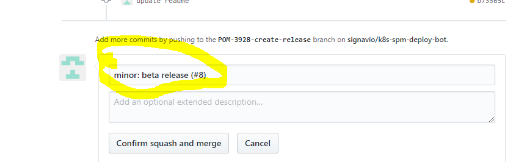

# plantuml-converter

## Install
Install from releases
```bash
curl -L https://github.com/signavio/plantuml-converter/releases/latest/download/plantuml-converter_$(uname -s)_amd64.gz -o plantuml-converter.gz
gunzip plantuml-converter.gz && chmod +x plantuml-converter && sudo mv plantuml-converter /usr/local/bin/plantuml-converter
plantuml-converter --help
```
<!--@startuml
:Hello worldasdsad;
:This is on defined on
several **lines**;
@enduml-->


### Versioning
Versioning is done automatically done with [Semantics](https://github.com/stevenmatthewt/semantics).
To increase the version any commit in master branch should start with `major:`, `minor:` or `patch:`.
If you squash merge make sure your **git message aka Merge Request Title** starts with one of these.

Once the branch was merged to master, semantics will create an incremented git tag.
Additional the cross-compiled binaries for windows, darwin and linux will be uploaded to releases.


<!--@startuml
:Hello world;
:This is on defined on
several **lines**;
@enduml-->


